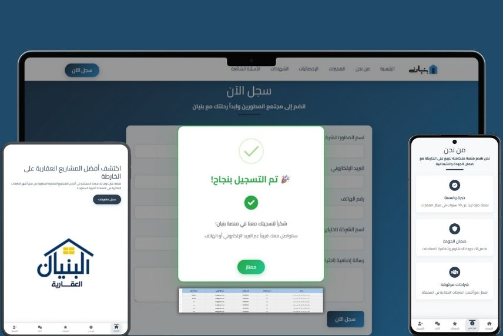
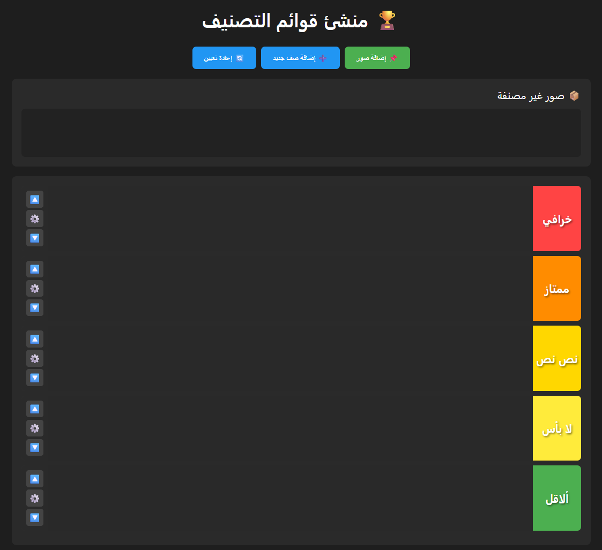
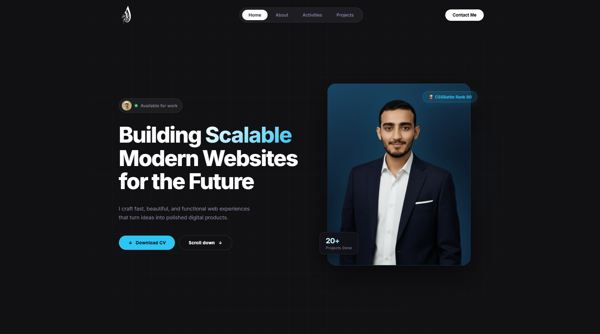

# مشاريع الواجهات الأمامية

مجموعة من مشاريع الويب التي تم تطويرها باستخدام تقنيات الواجهات الأمامية الحديثة.

## 📂 قائمة المشاريع

| Project                            | Preview                                                                          | Code                                       | Live Demo                                                                                       |
| ---------------------------------- | -------------------------------------------------------------------------------- | ------------------------------------------ | ----------------------------------------------------------------------------------------------- |
| **موقع راسية للرخام**              |  | [Source Code](./Rasia-Marble-Website-main) | [Live Demo](https://ibraheamit.github.io/frontend-engineer/projects/Rasia-Marble-Website-main/) |
| **منصة بنيان العقارية**            |   | [Source Code](./bonyan-real-estate-main)   | [Live Demo](https://ibraheamit.github.io/frontend-engineer/projects/bonyan-real-estate-main/)   |
| **منشئ قوائم التصنيف (Tier List)** |           | [Source Code](./Tier-List)                 | [Live Demo](https://ibraheamit.github.io/frontend-engineer/projects/Tier-List/)                 |
| **موقع شخصي**              |  | [Source Code](./Portfolio) | [Live Demo](https://ibraheamit.github.io/frontend-engineer/projects/Portfolio/) |

## 🛠️ التقنيات المستخدمة

- **HTML5 & CSS3**: لبناء الهيكل والتنسيق.
- **JavaScript (ES6+)**: لإضافة التفاعلية والمنطق.
- **Bootstrap / Responsive Design**: لضمان عمل المواقع على جميع الأجهزة.
- **Font Awesome & Google Fonts**: لتحسين المظهر والخطوط.

## 🚀 كيفية التشغيل

يمكن تشغيل أي من هذه المشاريع بسهولة:

1. افتح مجلد المشروع المراد تشغيله.
2. قم بفتح ملف `index.html` في المتصفح المفضل لديك.
